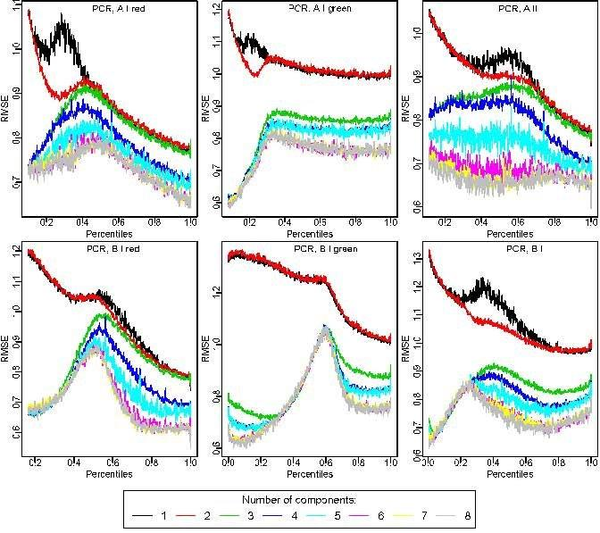

```{r style, echo=FALSE, results="asis", message=FALSE}
BiocStyle::markdown()
knitr::opts_chunk$set(tidy = FALSE,
                      warning = FALSE,
                      message = FALSE)
```

```{r library, echo=FALSE, results='hide', message=FALSE}
require(minfi)
```

#Introduction

The `funtooNorm` package provides a function for normalization of Illumina Infinium Human Methylation 450 BeadChip (Illumina 450K) data when there are samples from multiple tissues or cell types.  The algorithm in this package represents an extension of a normalization method introduced recently by [@Fortin2014;@Aryee2014]. In addition to the percentile-specific adjustments implemented in funNorm,
funtooNorm is specifically designed to allow flexibility in the adjustments for different cell types or tissue types. 
Percentiles of methylation levels may vary across cell types and hence the original funNorm may not be ideal if applied to all samples simultaneously.  Normalization separately for each cell type may introduce unwanted variability if sample sizes are small. Therefore, this algorithm provides flexibility while optimizing the sample size used to estimate the corrections.

Note that the current version of the package does not do a good job of normalizing the Y chromosome probes; the funNorm method performs better.  In a subsequent version of the package we will address this issue. 

#Normalization
##Terminology

 As described in the `minfi` vignette, the 450k array contains two types of probes:  
``` 
  CpGs measured using a Type I design are measured using a single color, 
  with two different probes in the same color channel providing
  the methylated and the unmethylated measurements. CpGs measured
  using a Type II design are measured using a single probe, and two
  different colors provide the methylated and the unmethylated 
  measurements.  
```  
Therefore, we separate the 6 types of signals in our method :
_AIGrn_, _BIGrn_, _AIRed_, _BIRed_, _AII_  and _BII_, where the __A__ (methylated) and
__B__ (unmethylated) are on __Green__ or __Red__ channel
depending on the 3 types : __Type I Red__, __Type I Green__ or
__Type II__. We will be careful to use position when referring to a CpG 
and not probe since the number of probes per position depends on the probe 
type of these position.  

##Loading Raw Data  

The first step is to create a new SampleSet for your data.
The SampleSet is an object of class S3, defined for the purpose of running the funtooNorm algorithm.
The SampleSet object contains the chip data and the cell type for each sample. 
There are two ways to load your data into R, depending on whether your files our in .csv or .idat format.  


   1. __csv files__: csv files are generated from the _Genome Studio_ software. After loading the data into Genome Studio, export the control probes file and the signal intensity file.  These csv files will contain the sample names as well as column headers. 
  Both files should contain the exact same samples in the same order.  
    
    Use the function `fromGenStudFiles`.  The first argument should be the control probe file, the second the signal file and last argument should be a vector containing the cell types. In order to avoid any assignment error, the vector elements should be named with the exact same sample labels as the Genome Studio files.  
    
    
   2. __idat files__:  Using the _minfi_ package, create a _RGChannelSet_ object containing all your samples and use the function _fromRGChannelSet_ to create your _SampleSet_. Please refer to the _minfi_ vignette on how to create a _RGChannelSet_. The phenotype data of your object should contain a column name *cell_type*, you can access it using the `pData` function 

There must be at least two different cell or tissue types in the data or the program will terminate with a warning.
  
##Example  

We have provided a small data set containing $N=6$ samples from the Illumina 450K to demonstrate `funtooNorm`. Since the sample are all the same cell type, this example will not produce meaningful results.

```{r}
    require(funtooNorm)
    require(minfiData)
    # We randomly assign cell types for the purpose of this example.
    pData(RGsetEx)$cell_type <- rep(c("type1","type2"),3)
    mySampleSet=fromRGChannelSet(RGsetEx)
```

The above script prepares your sampleSet object and your data is ready for normalization. Raw beta values can be extracted at this point.
get the Beta value before normalization. 

```{r}
    origBeta <- getRawBeta(mySampleSet)
    origBeta[1:3,1:3]
```

Before normalizing with funtooNorm you need to choose the ideal number of components, `ncmp`, for your data. We have set 4 as the default value for `ncmp`.

Choice of the number of components can be facilitated by examining a series of fits with different numbers of components: Calling the `plotValidationGraph` function with `type.fits = "PCR"` produces a set of plots, showing the root mean squared errors from cross-validated fits, for different numbers of components, separately for each type of signal AIGrn, BIGrn, AIRed, BIRed, AII, and BII.  The ideal `ncmp`  would be the smallest value where the cross-validated root mean squared error is fairly small across all the quantiles.

Figure 1. Cross-validated root mean squared errors across percentiles of the signal distributions for different numbers of PCR components.  signal A and B; probe type I red, probe type I green and probe type II.  

  

By default, `funtooNorm` will perform 10-fold cross-validation, but this can be changed with the parameter `ncv.fold`. Since this step 
can be very lengthy, we advice you to set the output of your plot to a pdf file: `file = "validationcurve.pdf"`. The default fit type is _PCR_, you can change it with `type.fits="PLS"`.  

```{r }
    plotValidationGraph(mySampleSet, type.fits="PCR")
```

Below is a basic call to the function `funtooNorm`: `funtooNorm` will fit either principal component regression (PCR) or partial least squares regression (PLS) by specifying `type.fits="PCR"` or `type.fits="PLS"`.  The default is set to __PCR__, to match funNorm.  An important user-chosen parameter is `ncmp`, the number of components to be included in either of these two models; these components are calculated from the control probe data and cell type data.

```{r normalize data}
    mySampleSet=funtooNorm(mySampleSet,type.fits="PCR",ncmp=3)
    mySampleSet
    normBeta <- getNormBeta(mySampleSet)
    normBeta[1:3,1:3]
```

To assess the performance of the normalization, if technical replicates are available, one can use a measure of intra-replicate differences __M__, described in [@Oros2016].  We provide a function `agreement` to implement calculation of this measure.  The function requires two arguments: a matrix of beta values and a vector of individual ID's.  Technical replicates will have identical individual ID's. The returned value of __M__ is expected to be more similar for the data after normalization:  

```{r}
    #technical replicates are fictional, just for demonstration purposes.
    agreement(origBeta, c(1:5,5)) # M for data before the normalization
    agreement(normBeta, c(1:5,5)) # M for data after normalization
``` 

#FuntooNorm and the minfi package


The `minfi` package [@Aryee2014] contains several tools for analyzing and visualizing Illumina's 450k array data. This section
shows how to incorporate the `funtooNorm` and `minfi` packages.  

##Using `minfi` to find differentially methylated CpG

Here we demonstrate the use of `dmpFinder` on the _M_ values:  $log(Meth/nmeth)$

```{r }
library(minfi)

    age=pData(RGsetEx)$age
    dmp=dmpFinder(getNormM(mySampleSet), age, type="continuous")
    dmp[1:2,]
``` 
##Creating GenomicRatioSet

Since normalization is rarely the final goal, this section illustrates how to convert the output of `funtooNorm` (the
`funtooNorm` object created in section 2.3) to a `GenomicRatioSet` object, so that it can be used by other tools in `minfi::bumphunter` or `minfi::blockFinder`.

First we extract the phenotype data provided in the RGset from the initial `minfi` example. Then we create the GenomicRatioSet which includes the normalized values and the phenotype data. 
```{r}

phenoData <- pData(RGsetEx)[,c("age","sex","status")]
genomerange <- getGRanges(mySampleSet)
grs <- GenomicRatioSet(gr=genomerange,
                       Beta=normBeta,
                       preprocessMethod="funtooNorm",
                       metadata=list(pData=phenoData))
grs
```

The default print method of a `GenomicRatioSet` object shows basic information of that object. In this example things were kept
simple in order to show the bare necessities.

```{r echo=FALSE}
sessionInfo()
```

#References
